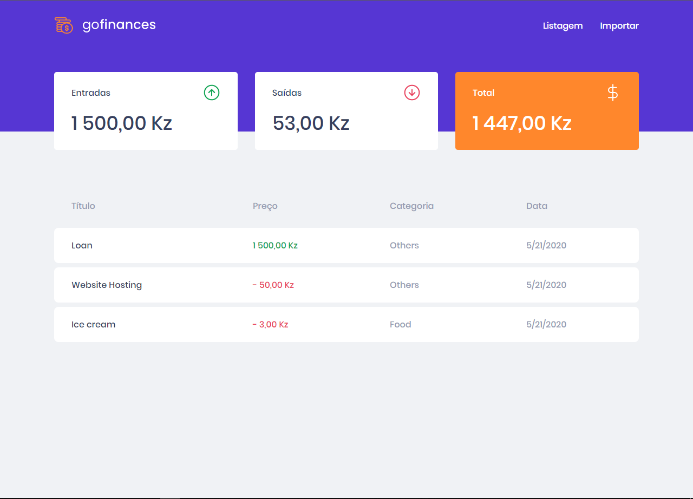
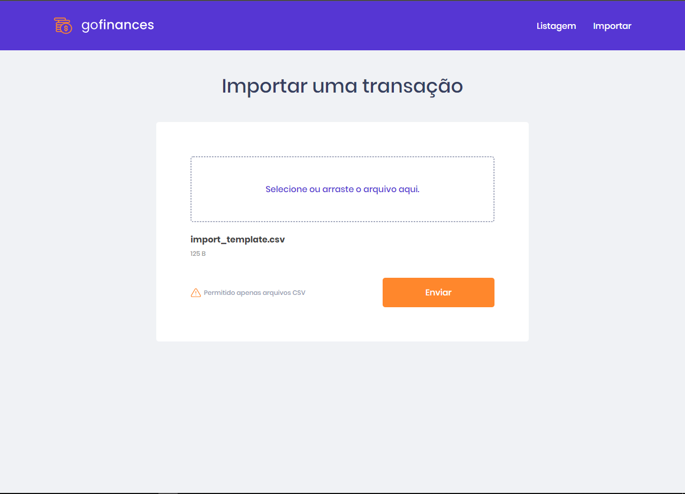

# GoFinances

<p> 
  This project is an simple example of one application for transactions managment.
  One of the challenges of the Rocketseat goStack 11 bootcamp!
</p>

## ✋🏻 Prerequisites

- [Node.js](https://nodejs.org/en/)
- [PostgreSql](https://www.postgresql.org/)
- [Yarn](https://yarnpkg.com/pt-BR/docs/install)

## Installation

Clone the repository, and install the dependencies by running the following commands:

```sh
  $ git clone https://github.com/jmamadeu/gofinances.git
```

```sh
  $ cd gofinances
```

```sh
  $ cd backend # and cd web
```

```sh
  $ yarn  # or npm install
```

Setup database settings inside `backend/ormconfig.json` file.

## Layout

<p>
  
<p>
<p>
  
<p>

## Running the application

Access the project folder and run the following command:

#### Frontend

```sh
  $ cd web
```

```sh
  $ yarn start # or npm run start
```

#### Backend/RestApi

```sh
  $ cd backend
```

```sh
  $ yarn dev:server # or npm run dev:server
```

## For running the tests

```sh
  $ cd backend # or cd web
```

```sh
  $ yarn test
```

## Contribution

Contributions are what make the open source community an incredible place to learn, inspire and create. Any contribution you make will be ** very valuable and appreciated **.

1. Fork the project
2. Create a Branch for your Feature (`git checkout -b feature/IncredibleFeature`)
3. Add your changes (`git add .`)
4. Commit your changes (`git commit -m 'Adding an awesome Feature!`)
5. Push the Branch (`git push origin feature/FeatureIncrivel`)
6. Open a Pull Request

## Author

<p>
  João Amadeu - [Linkedin](https://www.linkedin.com/in/jo%C3%A3o-amadeu-8812291a5/)
</p>
